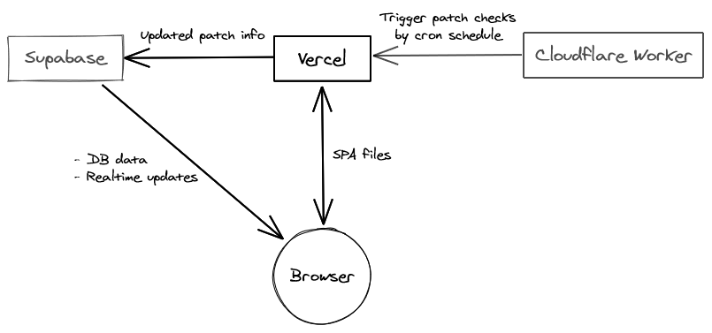

# isthepatchout

A website that automatically notifies when a new patch is released.

## Architecture

## Development

### Setup

1. Install dependencies: `$ yarn`
1. Copy the example `.env` file: `$ cp .env.example .env`
1. Install the Vercel CLI: `$ npm i -g vercel`
1. Run dev server: `$ vercel dev`
