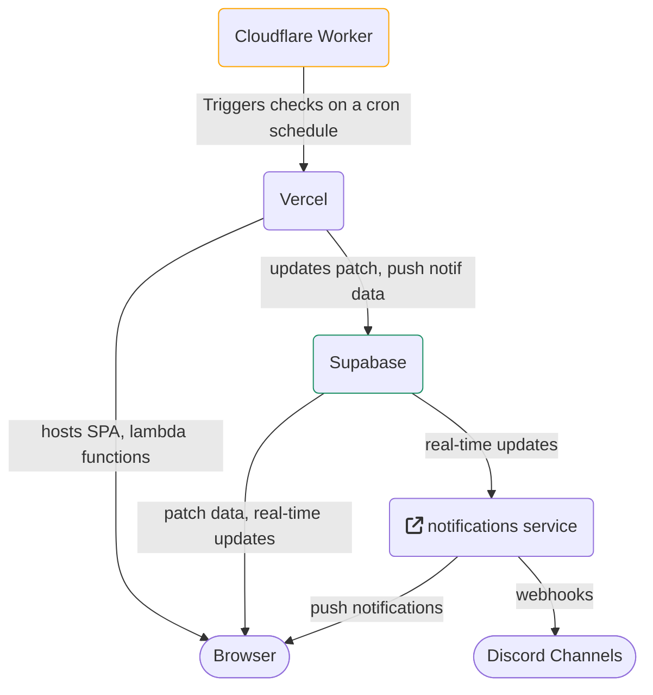

# isthepatchout

A website that automatically notifies when a new patch is released.

It also supports notifications via the [Web Push API](https://developer.mozilla.org/en-US/docs/Web/API/Push_API) and [Discord Webhooks](https://support.discord.com/hc/en-us/articles/228383668-Intro-to-Webhooks). Notifications are sent via the [`notifications`](https://github.com/isthepatchout/notifications) service.

This is accomplished by using [Supabase](https://supabase.com) and their real-time services to watch the `patches` table for new patches, and then doing what needs to be done based on it!

## Removing notifications

<details>
<summary>Discord</summary>

1. Go to the channel's settings <br/> 
1. Go to the integrations <br/> 
1. Delete the `isthepatchout` integration <br/> 

</details>

<details>
<summary>Web Push</summary>

Click the button that does it


or...

Deny the website access to notifications - google it!

</details>

## Privacy & GDPR

No PII data is stored. It only stores the data needed to send notifications, which is either:

- A Discord Webhook URL (e.g. `https://discord.com/api/webhooks/{random number}/{random string}`)
- Web Push API URL (e.g. `https://fcm.googleapis.com/fcm/send/{random string}`)

as well as which patch number was last sent to the recipient.

## Architecture



## Development

Requires Node ^16, Supabase CLI, Vercel CLI

### Setup

1. Install dependencies: `$ pnpm i`
1. Set up a local supabase instance: `$ supabase start`
1. Set up the `.env` file
   1. Create the file: `$ cp .env.example .env`
   1. Insert the values from starting the supabase instance, etc.
1. Install the Vercel CLI: `$ npm i -g vercel`
1. Run dev server: `$ vercel dev`

_Optional unless you need to work with realtime:_

Execute the following SQL query in the database:

```sql
ALTER PUBLICATION supabase_realtime ADD TABLE patches;
```
