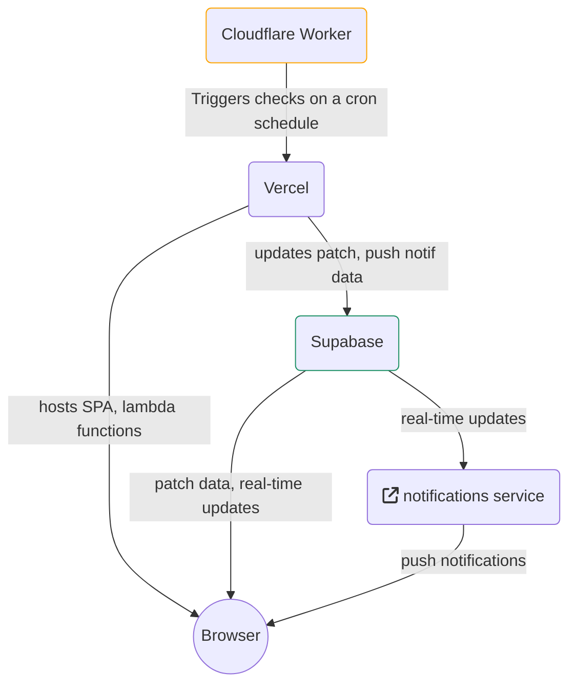

# isthepatchout

A website that automatically notifies when a new patch is released.

## Architecture



## Development

### Setup

1. Install dependencies: `$ yarn`
1. Set up a local supabase instance: `$ supabase start`
1. Set up the `.env` file
   1. Create the file: `$ cp .env.example .env`
   1. Insert the values from starting the supabase instance, etc.
1. Install the Vercel CLI: `$ npm i -g vercel`
1. Run dev server: `$ vercel dev`

_Optional unless you need to work with realtime:_

Execute the following SQL query in the database:

```sql
ALTER PUBLICATION supabase_realtime ADD TABLE patches;
```
